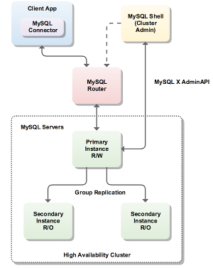

# MySQL InnoDB Cluster (local sandbox environment)


In this exercise we will build and test a InnoDB Cluster locally on one server. This type of local setup should only be used for testing and development environments, for production use cases you need to have the nodes in your cluster running on separate hosts to survive host failures.

Further reading:
- https://dev.mysql.com/doc/refman/8.0/en/mysql-innodb-cluster-userguide.html
- https://dev.mysql.com/doc/refman/8.0/en/mysql-innodb-cluster-sandbox-deployment.html

This demo works for both MySQL 5.7 as well as for MySQL 8, there are some small differences that will be highlighted later on. Note that MySQL Router 8 and MySQL Shell 8 works for MySQL 5.7 also, I highly recomend using latest versions of MySQL Shell and MySQL Router for any deployments of InnoDB Cluster.

### Setup environment

First step is to download this repository:
```
bash$ git clone https://github.com/wwwted/MySQL-InnoDB-Cluster-local-sandbox.git
```
or download zipfile manually direct from github and extract content.

Go to into folder:
```
bash$ cd MySQL-InnoDB-Cluster-local-sandbox
```
Now, you need to download binaries to run InnoDB Cluster, that is MySQL Server, MySQL Shell and MySQL Router.
If you already have downloaded all MySQL packages (tar packages) you can now create softlinks to targets (server,router,shell) like:
```
bash$ ln -s /path/to/binaries/mysql-server server
bash$ ln -s /path/to/binaries/mysql-shell shell
bash$ ln -s /path/to/binaries/mysql-router router
```
If you have not dowloaded the software yet, you can download everything by running:
```
./scripts/download.sh
```
and you will get latest versions of the software (per 2019-05-11) dowloaded, if you want latest versions simply edit the dowload script with correct minor version numbers.

Extract binaries from tar packages:
```
bash$ tar xzf mysql-8.0.11-linux-glibc2.12-x86_64.tar.gz
bash$ tar xzf mysql-shell-8.0.11-linux-glibc2.12-x86-64bit.tar.gz
bash$ tar xzf mysql-router-8.0.11-linux-glibc2.12-x86-64bit.tar.gz
```

Remove binary packages:
```
bash$ rm -fr mysql-8.0.11-linux-glibc2.12-x86_64.tar.gz
bash$ rm -fr mysql-shell-8.0.11-linux-glibc2.12-x86-64bit.tar.gz
bash$ rm -fr mysql-router-8.0.11-linux-glibc2.12-x86-64bit.tar.gz
```

Create softlinks to binaries:
```
bash$ ln -s mysql-8.0.11-linux-glibc2.12-x86_64 server
bash$ ln -s mysql-shell-8.0.11-linux-glibc2.12-x86-64bit shell
bash$ ln -s mysql-router-8.0.11-linux-glibc2.12-x86-64bit router
```

Last step in the preparations before we can start creating or cluster is to set the correct paths in our shell, this need to done in all windows/command line tools that you use to run commands in:
```
bash$ . ./setenv
```

Verify that all steps above have worked by running:
```
bash$ which mysql
bash$ which mysqlsh
bash$ which mysqlrouter
``` 
Output should be paths to your installed binaries.

You can now also try to start MySQL Shell and verify that it works:
```
bash$ mysqlsh
```
Take a look at commands available by running:
```
mysqlsh>dba.help();
```

Make sure you have configured SELinux and iptables/firewalld correctly (or disable them), you will need to have openings for ports 3310, 3320, 3330, 6446, 6447, 64460, 64470, 6606 for tcp/udp.

### Create a InnoDB Cluster


In this exercise when you use the sandbox commands for creating our cluster we can leverage that MySQL Shell can also create, configure and start our MySQL instances. These instances will be created underneith ~home/mysql-sandboxes and named by the port number you specify when creating your instances (in our case this will be 3310, 3320 and 3330).

If you want to monitor your instances during initial create and failover test later on I would suggest you start a new screen/prompt and run:
```
bash$ watch "pgrep -fla mysql | grep -v pgrep"
```
##### Create MySQL Instances

Before we create our 3 MySQL instances using `deploy.js` lets have a quick look at the content of this file:
```
dba.deploySandboxInstance(3310,{password:'root'});
dba.deploySandboxInstance(3320,{password:'root'});
dba.deploySandboxInstance(3330,{password:'root'});
```
The dba.deploySandboxInstance will fire up a local MySQL instance, only mandatory argument is a port number, you can provide more informaion via a second argument being a JSON document, in this case we are specifying the password for the root account.

Lets run deploy.js using shell to create our 3 MySQL instances:
```
bash$ mysqlsh < ./scripts/deploy.js
```

You should now have 3 MySQL instances up and running and you should see 3 folders (3310,3320 and 3330) in folder ~$HOME/mysql-sandboxes.
You can find the MySQL configuration file (my.cnf) under each folder, have a look at this file before we move on.

##### Create the InnoDB cluster

Next step is to create our cluster by running the `create.js` script, before we run this lets have a loot at the content of this file:
```
cluster=dba.createCluster("mycluster");
cluster.addInstance("root@127.0.0.1:3320",{password:'root'});
cluster.addInstance("root@127.0.0.1:3330",{password:'root'});
print (cluster.status());
```
The first command we use to create our cluster, this will be done on the MySQL we connect to when executing this script. Next we add the two other MySQL instances to our cluster using the addInstance command, before we exit we print the status of the cluster.  

Lets run ths `create.js` and have a look at output from the commands:
```
bash$ mysqlsh -uroot -proot -h127.0.0.1 -P3310 < scripts/create.js

A new InnoDB cluster will be created on instance 'root@127.0.0.1:3310'.

Validating instance at 127.0.0.1:3310...
Instance detected as a sandbox.
Please note that sandbox instances are only suitable for deploying test clusters for use within the same host.
...
            "127.0.0.1:3330": {
                "address": "127.0.0.1:3330", 
                "mode": "R/O", 
                "readReplicas": {}, 
                "role": "HA", 
                "status": "RECOVERING"
            }
        }
    },
```

Hmmm, looks like the last node of the cluster was still in state `RECOVERING` when we looked at status of the cluster, lets connect to our cluster and investigate this:
```
bash$ mysqlsh -uroot -proot -h127.0.0.1 -P3330
```
When loged into shell run:
```
cluster = dba.getCluster();
cluster.status();
```
State of last node should now be `ONLINE`

##### Persist cluster configuration in local MySQL configuration files (Only needed for MySQL 5.7)

Next step depends on what version of MySQL you are testing, if you are running MySQL 5.7 or MySQL 8.0.4 (or earlier) you need to make sure configuration changes made by create cluster commands are persisted.

If you are on a GA version of MySQL 8 this step is not needed as MySQL 8 now support `SET PERSISTS` and will update the local MySQL configuration automatically instead of the using the `dba.configureLocalInstance` command via shell.

Make sure configuration changes are persisted if you are running any MySQL version prior to 8.0.4:
```
mysqlsh -uroot -proot -h127.0.0.1 -P3310 < scripts/persist-config.js
``` 
You can run above command on later versions of MySQL 8 also but you will then get message like:
```
Calling this function on a cluster member is only required for MySQL versions 8.0.4 or earlier.
```

##### Start MySQL Router

Next step is to start the MySQL router that will handle application failover. To avoid tedious work creating configuration files you can run the `mysqlrouter`binary with option --bootstrap and router will connect to the specified node and extract information needed to build the configuratin from internal mysql_innodb_cluster_metadata schema.

```
mysqlrouter --bootstrap localhost:3310 -d myrouter
```
Provide password to MySQL instance 3310 when prompted for this (should be 'root').

After this command completes you should see a new folder named myrouter (name can be changed with option -d above), in this folder you will find the configuration file created for router and scripts for starting and stopping router.

Lets start the router:
```
./myrouter/start.sh
```
Verify that router started and look inside the newly created logfile `myrouter/log/mysqlrouter.log`

Router (as seen from configuration file) opens 2 ports, one for RW operations and one for RO operatons (6447), connect to router on RW port like:
```
mysql -uroot -proot -P6446 -h127.0.0.1
```
To what MySQL instance are you connnected? It should be 3310 that is the PRIMARY (R/W). Run command below to verify port number of instance:
```
mysql> SELECT @@PORT;
```

Try to connect to port 6447 and run the same command, try multiple times and see what happens.

### Test failover using python application.

There is a small python script than can be used to test what happens at failover, the script need the test database to be created before we can start it, connect to the R/W port of router:
```
mysql -uroot -proot -P6446 -h127.0.0.1
``` 
once connected run:
```
create database test;
```

Try to start the python script in a new window/prompt, it will continue to run forever (you can stop it via Ctrl-C):
```
python ./scripts/failover-demo.py 6446
```
If you get an error like "Authentication plugin 'caching_sha2_password' is not supported", see Note 1) below on how to fix this.

Output from the failover script should be:
```
ted@speedy:~/gitrepos/MySQL-InnoDB-Cluster-local-sandbox$ python ./scripts/failover-demo.py 6446
Starting to insert data into MySQL on port: 6446
inside  connect()
Hostname:speedy : 3310 ;  John:6 Doe
Hostname:speedy : 3310 ;  John:7 Doe
Hostname:speedy : 3310 ;  John:8 Doe
Hostname:speedy : 3310 ;  John:9 Doe
Hostname:speedy : 3310 ;  John:7 Doe
Hostname:speedy : 3310 ;  John:8 Doe
Hostname:speedy : 3310 ;  John:9 Doe
Hostname:speedy : 3310 ;  John:11 Doe
Hostname:speedy : 3310 ;  John:8 Doe
Hostname:speedy : 3310 ;  John:9 Doe
```
The script inserts one new employee every iteration and selects the last 5 employees at each iteration. The output also includes the variables (@@HOSTNAME and @@PORT) so we can see the instance we are connected to.

Once you have the python script up and running (or if this does not work, use normal MySQL Client to mimic a real aplication connected to your database) we will now kill the Primary instance of our InnoDB Cluster.

Identify the port number of the `Primary` by starting the shell (`mysqlsh -uroot -proot -h127.0.0.1 -P6446`) and run:
```
mysqlsh> cluster = dba.getCluster();
mysqlsh> cluster = cluster.status();
```
or by looking inside performance_schema like:
```
mysqlsh> \sql
mysqlsh> select * from performance_schema.replication_group_members\G
```
To get back to java script simple type `mysqlsh> \js` (short for Python is \py).

Now when we know which instance is Primary, get pid of that instance by running some processlisting like:
```
bash$ pgrep mysqld -fla
```
Identify the pid of of the instance with port number equal to the primary.

Lets kill the primary instance:
```
bash$ kill -9 <pif of primary instance>
``` 
You should see a small hickup in the output from the python application then the re-connect should have be triggered and the application should continue to work and output it's normal rows.

Log into your InnoDB cluster and look at status of your cluster:
```
mysql> select * from performance_schema.replication_group_members\G
*************************** 1. row ***************************
  CHANNEL_NAME: group_replication_applier
     MEMBER_ID: bb30d265-54f6-11e8-9445-ec21e522bf21
   MEMBER_HOST: speedy
   MEMBER_PORT: 3320
  MEMBER_STATE: ONLINE
   MEMBER_ROLE: PRIMARY
MEMBER_VERSION: 8.0.11
*************************** 2. row ***************************
  CHANNEL_NAME: group_replication_applier
     MEMBER_ID: c734a179-54f6-11e8-bcd8-ec21e522bf21
   MEMBER_HOST: speedy
   MEMBER_PORT: 3330
  MEMBER_STATE: ONLINE
   MEMBER_ROLE: SECONDARY
MEMBER_VERSION: 8.0.11
2 rows in set (0.0017 sec)
```
In my case the old primary was instance running on port 3310, this instance is not available anymore and new primary is instance running on port 3320.

Looking at `cluster.status()` via the shell we see similar information:
```
mysqlsh> cluster=dba.getCluster();
mysqlsh> cluster.status();
{
    "clusterName": "mycluster", 
    "defaultReplicaSet": {
        "name": "default", 
        "primary": "127.0.0.1:3320", 
        "ssl": "REQUIRED", 
        "status": "OK_NO_TOLERANCE", 
        "statusText": "Cluster is NOT tolerant to any failures. 1 member is not active", 
        "topology": {
            "127.0.0.1:3310": {
                "address": "127.0.0.1:3310", 
                "mode": "R/O", 
                "readReplicas": {}, 
                "role": "HA", 
                "status": "(MISSING)"
            }, 
            "127.0.0.1:3320": {
                "address": "127.0.0.1:3320", 
                "mode": "R/W", 
                "readReplicas": {}, 
                "role": "HA", 
                "status": "ONLINE"
            }, 
            "127.0.0.1:3330": {
                "address": "127.0.0.1:3330", 
                "mode": "R/O", 
                "readReplicas": {}, 
                "role": "HA", 
                "status": "ONLINE"
            }
        }
    }, 
    "groupInformationSourceMember": "mysql://root@127.0.0.1:6446/performance_schema"
}
```
Our old primary (port 3310 now have status MISSING).

##### Recover old primary instance
Steps for recovering a stopped/failed/missing instance are easy, first we need to start the MySQL instance, start MySQL Shell:
```
bash$ mysqlsh -uroot -proot -h127.0.0.1 -P6446
```
Then start the MySQL instance to have it joining the cluster again:
```
mysqlsh> dba.startSandboxInstance(3310);
```
Verify that old primary is now part of cluster again by looking at cluster.status() or data in table performance_schema.replication_group_members.

### Remove cluster/router setup (to start over)
If you want to remove your cluster and stop all MySQL instances simply run:
```
bash$ mysqlsh -uroot -proot -h127.0.0.1 -P3330 < ./scripts/remove.js
bash$ ./myrouter/stop.sh
bash$ rm -fr myrouter
```

The remove.js script will just stop the sandbox instances and the remove all data on disk using the delete command.
```
dba.stopSandboxInstance(3310,{password:'root'});
dba.stopSandboxInstance(3320,{password:'root'});
dba.stopSandboxInstance(3330,{password:'root'});
dba.deleteSandboxInstance(3310);
dba.deleteSandboxInstance(3320);
dba.deleteSandboxInstance(3330);
```
After this you should be able to start from the beginning again.

### Monitoring InnoDB CLuster
As we have already tried out there are ways to monitor InnoDB Cluster and the state via eather via the `cluster.status()` command or by quering the performance_schema.replication_group_members table.

MySQL Enterprise Monitor also have monitoring of InnoDB Cluster so you can track the state of your cluster and get alerts if there are problems.

### Other tools
If you want to look at number of rows in the different MySQL instances during failover your can run:
```
bash$ watch ./scripts/count.sh
```

[Commands for HA DEMO without all the explanations and text](https://gist.github.com/wwwted/f11062e47d5265ea386d6c0976cd7a06)

### Note 1) Problems running script on MySQL due to new authentication plugin (only MySQL 8)
If you get an error like "Authentication plugin 'caching_sha2_password' is not supported" this means you have python connecter that does not support the new authentication plugn in MySQL 8, no worries, this is true for many 3rd party connectors at the moment and can be solved by configuring MySQL to use old password auth plugin and change plugin for user 'root'.

Run commands below to start using old authentication plugin and set this as plugin for existing 'root' account. It should be enough to set the authentication method for the 'root' account but it looks like the python connector is also looking at MySQL setting for parameter `default_authentication_plugin` and aborts with error message above if this is set to "caching_sha2_password".

Let's first update the configuration and add the line:
```
default_authentication_plugin=mysql_native_password
```
to all instances (the configuration are located at ~$HOME/mysql-sandboxes/$PORT/my.cnf. Make sure you update all 3 nodes (in folders 3310, 3320 and 3330).

Once you have added this line the the configuraton of all instances start the mysql shell
```
mysqlsh
```
and restart the MySQL instances one at a time by running:
```
mysqlsh> dba.stopSandboxInstance(3310);
mysqlsh> dba.startSandboxInstance(3310);
```
Password of all MySQL instances is 'root', this is needed to stop the MySQL instance.

Look at status of your cluster after each node restart, what is happening with the Primary/RW Role?
```
mysqlsh> \c 'root'@127.0.0.1:3320
mysqlsh> cluster = dba.getCluster();
mysqlsh> cluster.status();
```
You need to connect to a running MySQL instance between restarts to see status of the cluster.

Next step is to update our 'root' user to use old plugin, start the mysql client:
```
mysql -uroot -proot -P6446 -h127.0.0.1
```
and then update both 'root' accounts:
```
mysql> ALTER USER 'root'@'%' IDENTIFIED WITH mysql_native_password BY 'root';
mysql> ALTER USER 'root'@'localhost' IDENTIFIED WITH mysql_native_password BY 'root';
```

If you still have problems running start the MySQL client via router like:
```
mysql -uroot -proot -P6446 -h127.0.0.1
```
and look at output from commands below, they should look like:
```
mysql> show global variables like 'default_authentication_plugin';
+-------------------------------+-----------------------+
| Variable_name                 | Value                 |
+-------------------------------+-----------------------+
| default_authentication_plugin | mysql_native_password |
+-------------------------------+-----------------------+

mysql> select user,host,plugin from mysql.user where user='root';
+------+-----------+-----------------------+
| user | host      | plugin                |
+------+-----------+-----------------------+
| root | %         | mysql_native_password |
| root | localhost | mysql_native_password |
+------+-----------+-----------------------+
```
